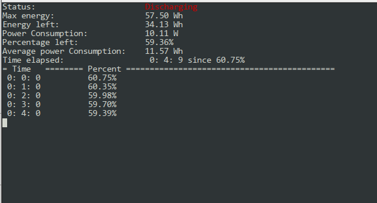

# batstat
CLI battery status for linux

# Features
* Current battery level
* Current Energy
* Full charge energy
* Time elapsed from the start of the program, without tracking the sleep time of the machine
* Battery level history



# Install
```sh

$ sudo apt-get install make g++ libncurses5-dev
$ sudo make build
$ sudo make install

```

# Limitations
* Only 1 battery supported
* Gathers data only from `/sys/class/power_supply/`
  If your machine contains the battery information in a different folder, this program will not work.

# Dependencies
* ncurses C++ library

# Compilation command
```sh
$ make
```
